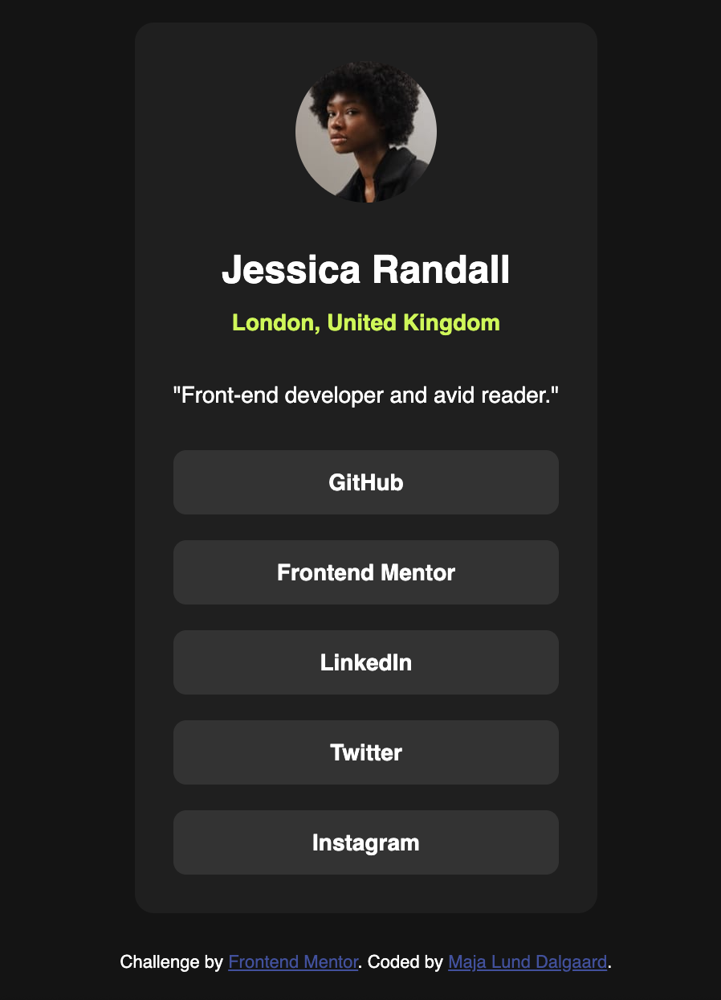

# Frontend Mentor - Social links profile solution

This is a solution to the [Social links profile challenge on Frontend Mentor](https://www.frontendmentor.io/challenges/social-links-profile-UG32l9m6dQ). Frontend Mentor challenges help you improve your coding skills by building realistic projects. 

## Table of contents

- [Overview](#overview)
  - [The challenge](#the-challenge)
  - [Screenshot](#screenshot)
  - [Links](#links)
- [My process](#my-process)
  - [Built with](#built-with)
  - [What I learned](#what-i-learned)
- [Author](#author)

## Overview

### The challenge

Users should be able to:

- See hover and focus states for all interactive elements on the page

### Screenshot

### Links

- Solution URL: https://github.com/majdal01/social-links-profile.git
- Live Site URL: https://majdal01.github.io/social-links-profile/

## My process

Mostly focused on ensuring responsiveness and semantic markup. 

### Built with

- Semantic HTML5 markup
- CSS custom properties
- Flexbox
- CSS Grid

### What I learned

Well, I actually have an issue with the solution. My a-tags are not as wide as they should be. But I struggle to find out, how to make them without loosing the resonsiveness

Should I maybe have used grid??

## Author

- Frontend Mentor - https://www.frontendmentor.io/profile/majdal01

